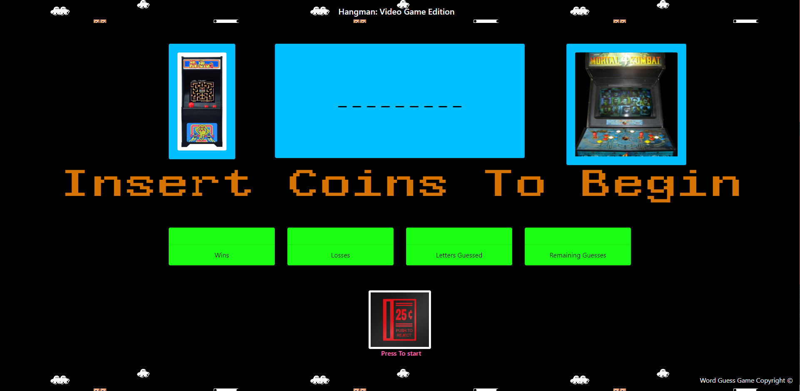

# **Word Guess Game**
A simple app that allows the user to play a hangman style of game. 

## **Overview**
This app will allow the user to choose a word, but one letter at a time.  The user will choose a letter, and if they guess right, then the letter will show in the UI.  If they guess wrong then the letter will show in the already guessed letter UI. The game ends when the user runs out of guesses, or guesses the word.

## **Link To App**
https://blnicholson.github.io/word-guess-game
## **Technical Information**
This app was created by using the following:

* JavaScript
* HTML
* CSS
## **Game Images **

